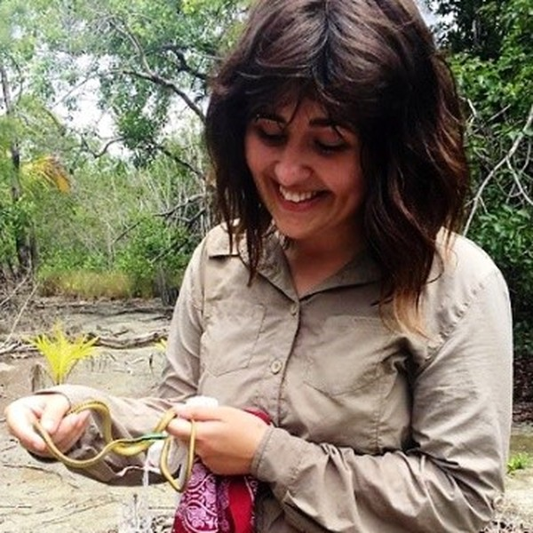

```{=html}
<style>#title-block-header{display:none}</style>

<section class="hero hero-photo" style="background-image:url('images/hero.jpg')">
</section>

<div style="max-width:1200px;margin:0 auto">

<section class="section profile">
  
  <div class="profile-card">
    
    <h2 class="profile-name">Dr Emma Higgins</h2>
    <p class="profile-role">Lecturer in Ecology</p>
    <p class="profile-inst">University of South Wales</p>
    <ul class="profile-links">
      <li><a href="mailto:emma.higgins@southwales.ac.uk" aria-label="Email" title="Email"><i class="bi bi-envelope-fill"></i></a></li>
      <li><a href="https://orcid.org/0000-0001-6039-8960" aria-label="ORCID" title="ORCID" class="txt-icon">iD</a></li>
      <li><a href="https://www.researchgate.net/profile/Emma-Higgins-5" aria-label="ResearchGate" title="ResearchGate" class="txt-icon">RG</a></li>
      <li><a href="https://bsky.app/profile/eangharad.bsky.social" aria-label="Bluesky" title="Bluesky"><i class="bi bi-bluesky"></i></a></li>
      <li><a href="https://www.linkedin.com/in/emma-higgins-91533184" aria-label="LinkedIn" title="LinkedIn"><i class="bi bi-linkedin"></i></a></li>
      <li><a href="https://github.com/eahiggins" aria-label="GitHub" title="GitHub"><i class="bi bi-github"></i></a></li>
      <li><a href="https://pure.southwales.ac.uk/en/persons/emma-higgins" aria-label="University of South Wales Pure profile" title="Pure profile (USW)" class="txt-icon">USW</a></li>
    </ul>
  </div>
  <div class="profile-body">
    
    <h2 class="profile-h">Biography</h2>
    <p class="lede">I'm a conservation technologist and ecologist. My work asks how technology can improve how we monitor wildlife and habitats, and how best to integrate remote sensing and conservation technology workflows into conservation planning decisions.</p>
    <p>I lecture in Ecology at the University of South Wales. I am Course Leader for the new MSc Conservation Technology and Ecological Data Science, launching in 2028, and Associate Editor for <em>Remote Sensing in Ecology and Conservation</em> and <em>Methods in Ecology and Evolution</em>.</p>
    <p class="btn-row"><a class="btn-field" href="join.html">Prospective students</a><a class="btn-field btn-outline" href="mailto:emma.higgins@southwales.ac.uk?subject=Collaboration">Interested in collaborating?</a></p>
    <div class="profile-cols">
      <div>
        <h3 class="profile-h">Interests</h3>
        <ul class="icon-list">
          <li><i class="bi bi-bookmark-fill"></i>Conservation technology</li>
          <li><i class="bi bi-bookmark-fill"></i>Remote sensing &amp; UAVs</li>
          <li><i class="bi bi-bookmark-fill"></i>Movement ecology</li>
          <li><i class="bi bi-bookmark-fill"></i>Thermal ecology</li>
          <li><i class="bi bi-bookmark-fill"></i>Passive acoustic monitoring</li>
          <li><i class="bi bi-bookmark-fill"></i>Machine learning for ecology</li>
        </ul>
      </div>
      <div>
        <h3 class="profile-h">Education</h3>
        <ul class="icon-list edu">
          <li><i class="bi bi-mortarboard-fill"></i><span><strong>PhD Geography</strong>, 2022<br><span class="muted">University of Nottingham</span></span></li>
          <li><i class="bi bi-mortarboard-fill"></i><span><strong>MSc Conservation and GIS</strong>, 2015<br><span class="muted">University of South Wales</span></span></li>
          <li><i class="bi bi-mortarboard-fill"></i><span><strong>BSc (Hons) Biology</strong>, 2014<br><span class="muted">University of South Wales</span></span></li>
        </ul>
      </div>
    </div>
  </div>
</section>

<section class="section">
  <div class="section-head"><h2>Research</h2><a href="research.html">All research →</a></div>
```

::: {#featured}
:::

```{=html}
</section>

<section class="section panel panel-bold">
  <h3>Get in touch</h3>
  <p>I'm happy to hear from prospective students, collaborators and conservation partners.</p>
  <ul class="contact-list">
    <li><i class="bi bi-envelope-fill"></i><span><strong>Email | E-bost:</strong> <a href="mailto:emma.higgins@southwales.ac.uk">emma.higgins@southwales.ac.uk</a></span></li>
    <li><i class="bi bi-bluesky"></i><span><strong>Bluesky:</strong> <a href="https://bsky.app/profile/eangharad.bsky.social">@eangharad.bsky.social</a></span></li>
    <li><i class="bi bi-linkedin"></i><span><strong>LinkedIn:</strong> <a href="https://www.linkedin.com/in/emma-higgins-91533184">linkedin.com/in/emma-higgins-91533184</a></span></li>
    <li><i class="bi bi-github"></i><span><strong>GitHub:</strong> <a href="https://github.com/eahiggins">github.com/eahiggins</a></span></li>
    <li><i class="bi bi-journal-text"></i><span><strong>ResearchGate:</strong> <a href="https://www.researchgate.net/profile/Emma-Higgins-5">Emma Higgins</a></span></li>
    <li><i class="bi bi-building"></i><span><strong>Pure profile:</strong> <a href="https://pure.southwales.ac.uk/en/persons/emma-higgins">Emma Higgins, University of South Wales</a></span></li>
  </ul>
</section>

</div>
```
