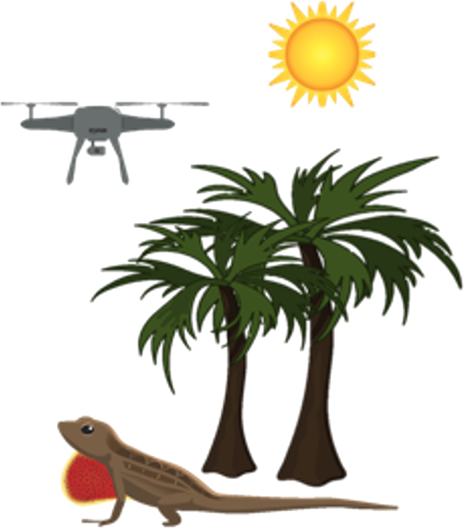
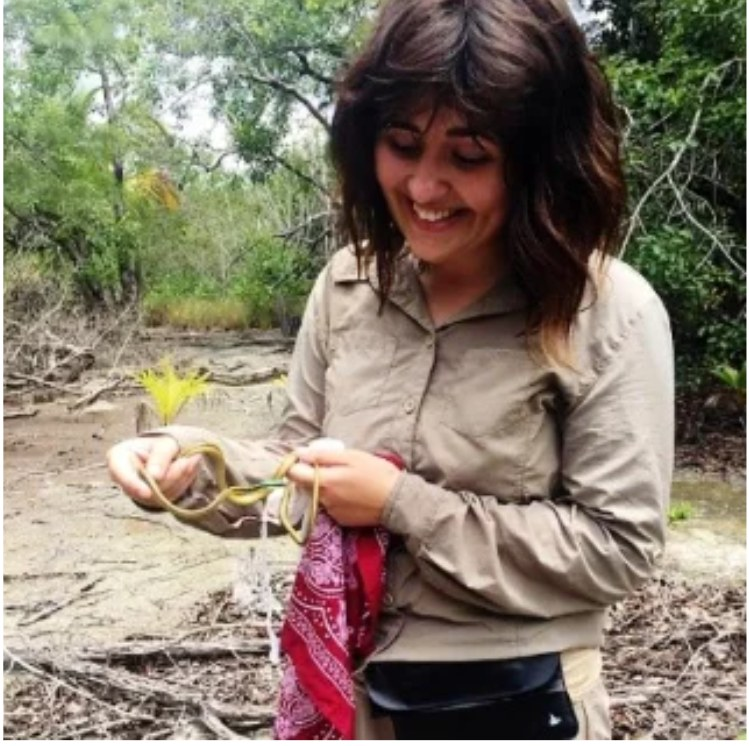
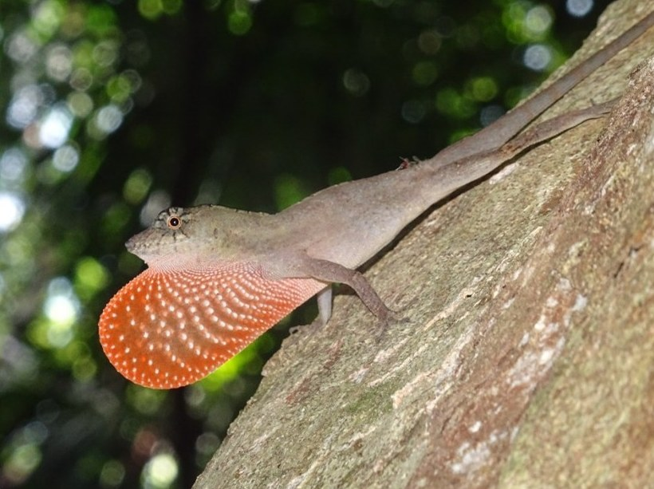

```{=html}
<style>#title-block-header{display:none}</style>
<div class="page-title-block">
  
  <h1>Work with me</h1>
  <p>Opportunities for students and collaborators in conservation technology and field ecology.</p>
</div>
```

I welcome enquiries from prospective PhD, MRes and MSc by Research students.

```{=html}
<div class="photo-pair">
  
  
</div>
```

## Areas I supervise

- Remote sensing and earth observation for conservation
- Conservation technology and sensor networks
- Thermal and spatial ecology
- Machine learning for ecological data

## Collaborators

I'm always keen to hear from researchers, conservation organisations, protected area managers and technology developers who are interested in working together. I welcome joint research projects and funding bids, co-supervision of students, data-sharing partnerships, and opportunities to develop and test new conservation technologies in the field.

```{=html}
<p class="btn-row"><a class="btn-field btn-outline" href="mailto:emma.higgins@southwales.ac.uk?subject=Collaboration">Interested in collaborating?</a></p>
```

## How to get in touch

Prospective students, email me with:

1. a short paragraph on your background and interests
2. the kind of project you'd like to do
3. your CV
4. any funding you have or plan to apply for

::: {.panel}
**Email** · emma.higgins@southwales.ac.uk
:::
