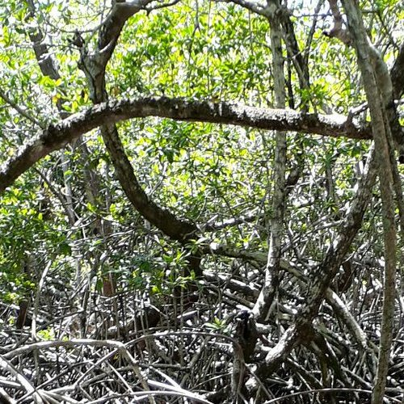
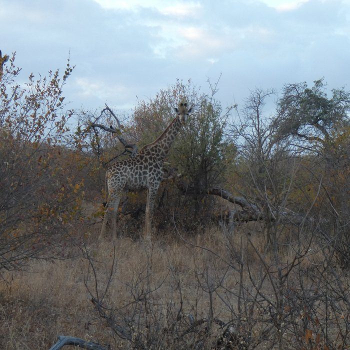
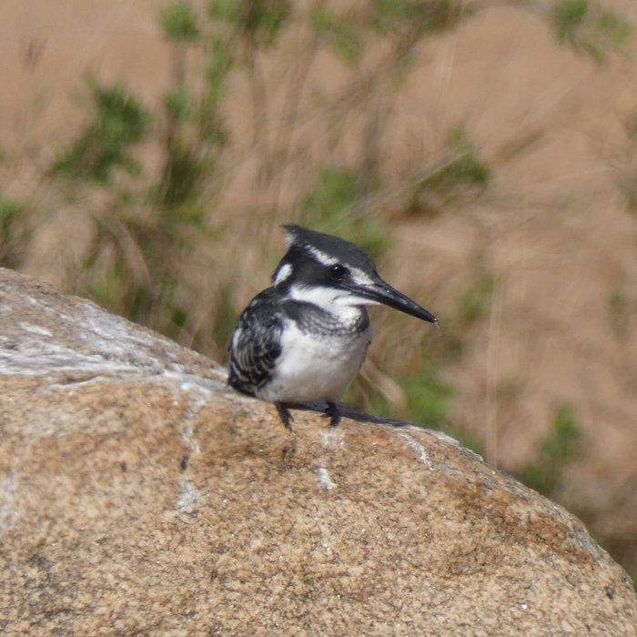
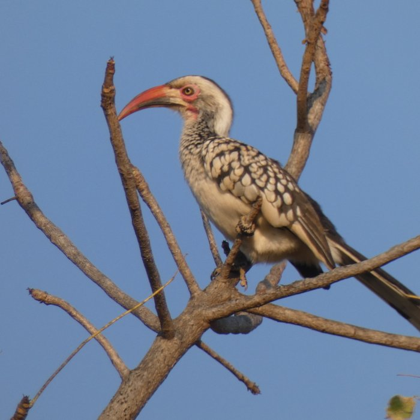
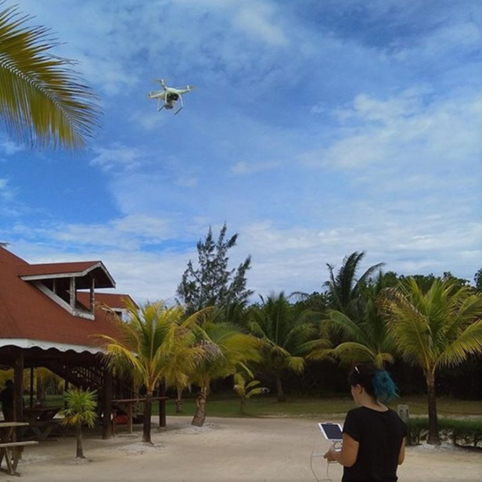
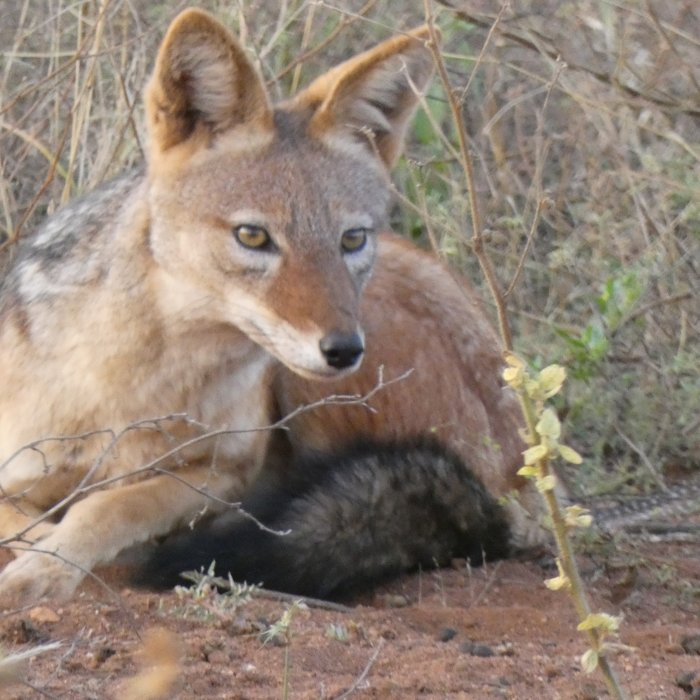
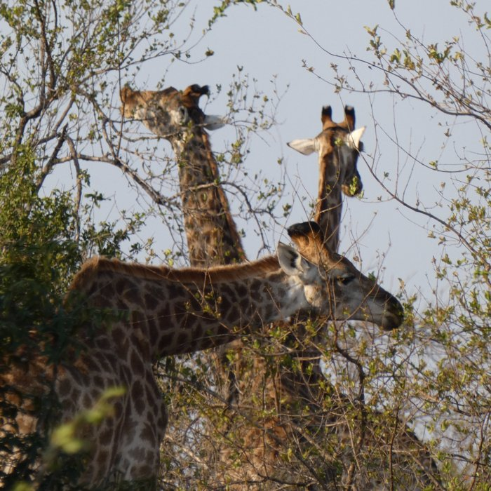
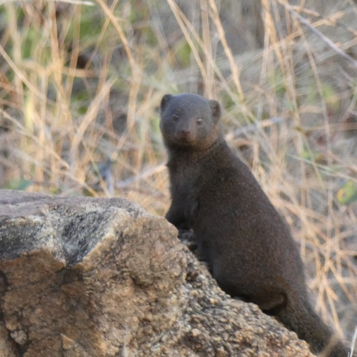
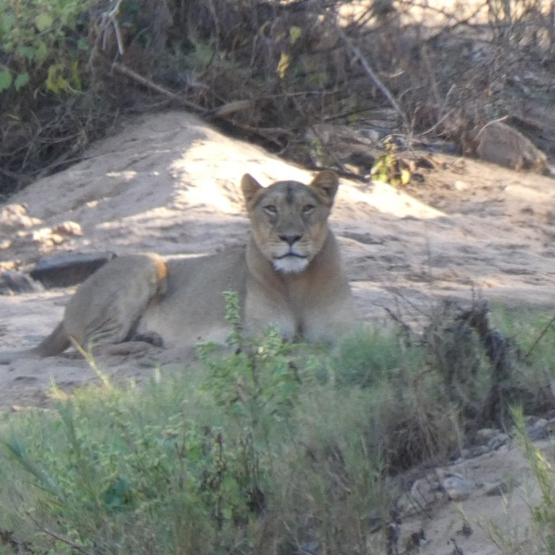

```{=html}
<style>#title-block-header{display:none}</style>
<div class="page-title-block">
  
  <h1>Teaching</h1>
</div>
```

```{=html}
<div class="bubbles" aria-label="Photos from fieldwork and field courses">
  
  
  
  
  
  
  
  
  
</div>
```

I teach ecology, conservation biology, statistics, remote sensing and conservation technology at undergraduate and postgraduate level at the University of South Wales, with a strong emphasis on fieldwork and hands-on data collection.

## Roles

- Faculty Fieldwork Coordinator
- Course Leader, MSc Conservation Technology and Ecological Data Science (from 2028)

## Modules I lead

- Biodiversity
- Ecological Consultancy
- Conservation Technology

## In the field

Students on our courses collect real data with camera traps, drones and acoustic sensors on field courses in South Africa, Wales and beyond.
